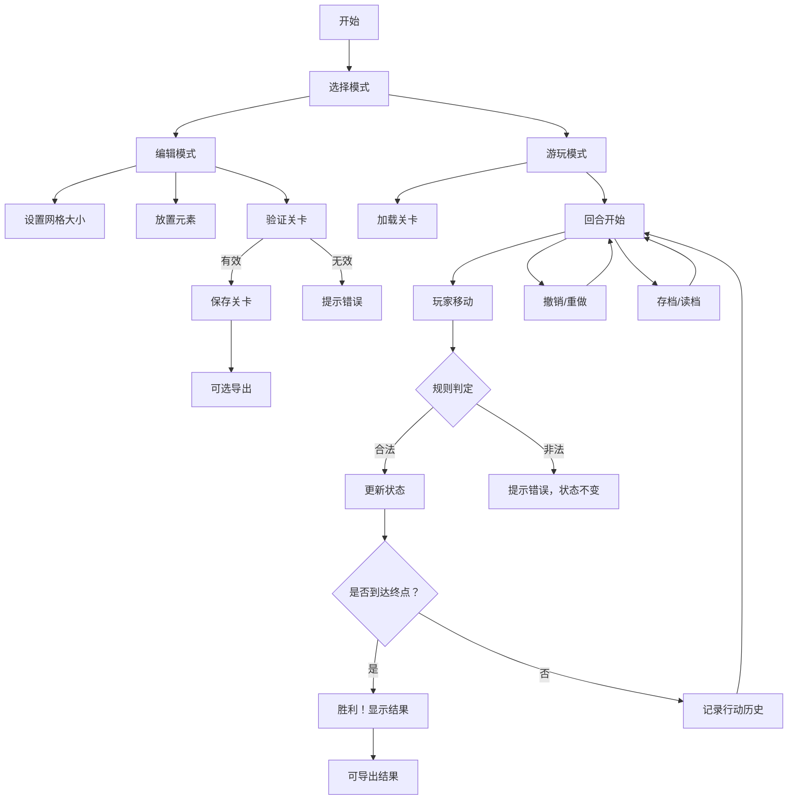

## 1. 产品概述

本地回合制解谜关卡编辑与游玩工具，支持用户自定义创建包含网格、起点终点、障碍、钥匙、门和机关的解谜关卡，并可保存、加载、导出关卡，以及游玩时的完整回合制推进、行动历史、撤销重做和失败恢复功能。

- 核心价值：为解谜游戏爱好者提供从零开始设计关卡并亲自体验的完整闭环
- 目标用户：解谜游戏玩家、关卡设计师、教育工作者

## 2. 核心功能

### 2.1 用户角色

| 角色 | 注册方式 | 核心权限 |
|------|----------|----------|
| 普通用户 | 无需注册，本地使用 | 编辑关卡、游玩关卡、保存读取、导出导入 |

### 2.2 功能模块

1. **关卡编辑器**：网格大小设置、元素放置（起点、终点、墙、钥匙、门、机关）、关卡保存
2. **关卡游玩器**：回合制移动、拾取钥匙、开门、触发机关、胜负判定
3. **行动历史系统**：完整行动日志、撤销（Undo）、重做（Redo）
4. **存档系统**：自动存档、手动存档、读取存档、失败恢复
5. **导出导入**：关卡包导出（JSON格式）、关卡包导入
6. **样例关卡**：内置至少两个完整可玩的样例关卡

### 2.3 页面详情

| 页面名称 | 模块名称 | 功能描述 |
|---------|---------|----------|
| 主页面 | 顶部导航 | 切换编辑/游玩模式、新建关卡、保存、读取、导出、导入 |
| 主页面 | 关卡编辑器 | 网格渲染、元素选择工具栏、点击放置/删除元素 |
| 主页面 | 关卡游玩器 | 玩家渲染、状态面板（背包、门状态、机关状态）、移动控制 |
| 主页面 | 行动历史面板 | 显示每一步行动、撤销按钮、重做按钮 |
| 主页面 | 状态提示区 | 显示当前回合数、胜负结果、错误提示 |

## 3. 核心流程

### 编辑关卡流程
1. 用户进入编辑模式
2. 设置网格大小（如 8x8）
3. 选择元素类型（起点、终点、墙、钥匙、门、机关）
4. 点击网格放置或删除元素
5. 保存关卡（自动验证：必须有且仅有一个起点和终点，终点需可达）
6. 可选择导出关卡包

### 游玩关卡流程
1. 用户选择关卡（内置样例或自定义关卡）
2. 进入游玩模式，显示初始状态
3. 用户使用方向键或按钮移动（每步消耗一回合）
4. 移动时自动触发规则：
   - 遇到墙：移动失败，提示错误
   - 遇到钥匙：自动拾取，加入背包
   - 遇到门：检查背包是否有对应钥匙，有则开门通过，否则失败
   - 遇到机关：触发机关状态变化（门的开关状态）
   - 到达终点：胜利判定
5. 可随时撤销/重做操作
6. 可保存当前进度，下次读取继续
7. 失败时可恢复到上一存档点或初始状态

### 核心流程图

## 4. 用户界面设计

### 4.1 设计风格

- **整体风格**：现代简约风，带有像素/复古游戏元素的精致感
- **主色调**：深蓝紫色调 (#1a1a2e) 作为背景，配合青色 (#00d9ff) 作为主强调色，橙色 (#ff9500) 作为辅助强调色
- **按钮风格**：圆角矩形，带有轻微阴影，hover时有发光效果
- **字体**：标题使用 "Press Start 2P" 像素风格字体（或 fallback 为 monospace），正文使用 "JetBrains Mono" 等宽字体
- **布局风格**：三栏布局（左：工具栏/状态面板，中：游戏网格，右：行动历史）
- **图标风格**：使用 emoji 或简单 SVG 图标表示游戏元素（🚪 门，🔑 钥匙，⚙️ 机关，🏁 终点，🧍 玩家）

### 4.2 页面设计概述

| 页面名称 | 模块名称 | UI 元素 |
|---------|---------|---------|
| 主页面 | 顶部导航栏 | 模式切换开关、新建按钮、保存按钮、读取按钮、导出按钮、导入按钮 |
| 主页面 | 左侧工具栏 | 元素选择按钮组（起点、终点、墙、钥匙、门、机关）、网格大小设置 |
| 主页面 | 中央游戏区 | 网格渲染（编辑模式下点击放置，游玩模式下显示移动）、回合数显示 |
| 主页面 | 右侧状态面板 | 背包显示、门状态列表、机关状态列表 |
| 主页面 | 底部行动历史 | 滚动列表显示每一步行动、撤销按钮、重做按钮 |

### 4.3 响应式设计

- **桌面端（主）**：三栏完整布局，游戏网格居中显示
- **平板端**：左右面板可折叠，游戏网格自适应缩放
- **移动端**：垂直堆叠布局，优先显示游戏网格，面板通过抽屉或标签切换

### 4.4 视觉动效

- 网格元素放置/删除时的缩放动画
- 玩家移动时的平滑过渡动画
- 拾取钥匙、开门时的闪光效果
- 撤销/重做时的状态回退动画
- 胜利时的庆祝动画（彩带、闪光）
- 错误提示时的轻微抖动效果
