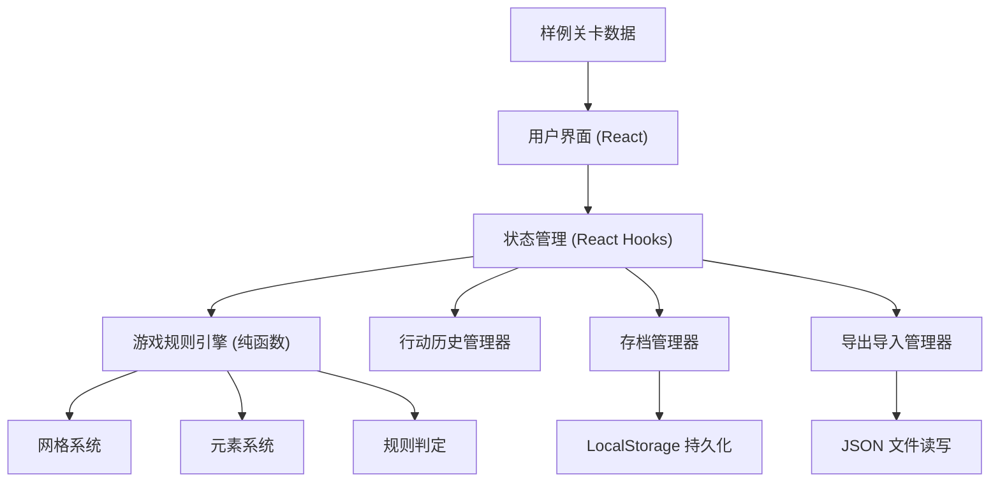

## 1. 架构设计



## 2. 技术描述

- **前端框架**：React 18 + TypeScript
- **构建工具**：Vite 5
- **样式方案**：Tailwind CSS 3
- **状态管理**：React Hooks (useState, useReducer, useCallback)
- **持久化**：LocalStorage API
- **图标方案**：Emoji + 简单 SVG
- **动画方案**：CSS Transitions + CSS Keyframes
- **无后端依赖**：纯前端本地应用

## 3. 目录结构

```
src/
├── types/              # 类型定义
│   └── game.ts         # 游戏相关类型
├── game/               # 游戏核心逻辑
│   ├── engine.ts       # 游戏规则引擎
│   ├── grid.ts         # 网格操作
│   ├── rules.ts        # 规则判定
│   └── history.ts      # 历史管理
├── data/               # 数据
│   └── sampleLevels.ts # 样例关卡
├── components/         # React 组件
│   ├── App.tsx         # 主组件
│   ├── Grid.tsx        # 网格组件
│   ├── Toolbar.tsx     # 工具栏
│   ├── StatusPanel.tsx # 状态面板
│   ├── HistoryPanel.tsx # 历史面板
│   └── Controls.tsx    # 控制按钮
├── hooks/              # 自定义 Hooks
│   ├── useGameState.ts # 游戏状态管理
│   └── useStorage.ts   # 本地存储
├── utils/              # 工具函数
│   ├── storage.ts      # 存储工具
│   ├── export.ts       # 导出导入
│   └── validate.ts     # 验证工具
├── App.css             # 全局样式
├── main.tsx            # 入口
└── index.css           # Tailwind 入口
```

## 4. 核心数据结构

### 4.1 游戏元素类型

```typescript
// 单元格类型
type CellType = 'empty' | 'wall' | 'start' | 'end' | 'key' | 'door' | 'mechanism';

// 方向
type Direction = 'up' | 'down' | 'left' | 'right';

// 位置
interface Position {
  x: number;
  y: number;
}

// 门/钥匙/机关的颜色标识
type Color = 'red' | 'blue' | 'green' | 'yellow';

// 游戏元素（带属性）
interface GameElement {
  type: CellType;
  color?: Color; // 用于钥匙、门、机关
  id?: string;   // 唯一标识
  isOpen?: boolean; // 门是否打开
  isActive?: boolean; // 机关是否激活
}

// 单元格
interface Cell {
  x: number;
  y: number;
  element: GameElement | null;
}

// 关卡配置
interface Level {
  id: string;
  name: string;
  width: number;
  height: number;
  grid: Cell[][];
  startPos: Position;
  endPos: Position;
}

// 玩家状态
interface PlayerState {
  position: Position;
  inventory: Color[]; // 背包中的钥匙颜色
}

// 游戏状态
interface GameState {
  level: Level;
  player: PlayerState;
  turn: number;
  isGameOver: boolean;
  isWin: boolean;
  message: string;
}

// 行动记录
interface Action {
  id: string;
  type: 'move' | 'pickup' | 'openDoor' | 'triggerMechanism';
  direction?: Direction;
  position: Position;
  description: string;
  timestamp: number;
  stateSnapshot: GameState; // 用于撤销重做的完整快照
}

// 存档
interface SaveData {
  id: string;
  name: string;
  timestamp: number;
  gameState: GameState;
  actionHistory: Action[];
  historyIndex: number;
  bestMoves?: number;
}
```

## 5. 核心算法

### 5.1 移动规则判定

1. **越界检查**：目标位置 x < 0 || x >= width || y < 0 || y >= height → 非法
2. **障碍检查**：目标位置是墙 → 非法
3. **门检查**：目标位置是门且未打开 → 检查背包是否有对应颜色钥匙
   - 有钥匙：移除钥匙，开门，允许通过
   - 无钥匙：非法，提示错误
4. **钥匙检查**：目标位置是钥匙 → 拾取加入背包，移除钥匙
5. **机关检查**：目标位置是机关 → 触发机关，切换所有同颜色门的状态
6. **终点检查**：目标位置是终点 → 胜利判定

### 5.2 终点可达性验证（BFS）

编辑模式保存关卡时使用：
1. 从起点出发，使用 BFS 遍历所有可达位置
2. 考虑门的状态（默认关闭，需对应钥匙才能通过）
3. 检查终点是否在可达集合中
4. 若不可达，提示用户调整关卡

### 5.3 撤销重做实现

使用双栈（历史栈 + 重做栈）或单数组 + 索引：
- `actionHistory: Action[]` 存储所有行动
- `historyIndex: number` 指向当前状态在历史中的位置
- 执行新行动：截断 `historyIndex` 之后的历史，追加新行动，`historyIndex++`
- 撤销：`historyIndex--`，恢复对应状态快照
- 重做：`historyIndex++`，恢复对应状态快照
- 边界检查：`historyIndex < 0` 不可撤销，`historyIndex >= actionHistory.length` 不可重做

### 5.4 本地持久化

使用 LocalStorage 存储：
- `puzzle_levels`：所有自定义关卡列表
- `puzzle_saves`：所有存档列表
- `puzzle_best_moves`：各关卡的最佳步数记录
- `puzzle_current_state`：当前游戏状态（用于刷新恢复）

## 6. 错误处理边界

| 错误场景 | 处理方式 | 行动栈影响 |
|---------|---------|-----------|
| 关卡缺少起点或终点 | 保存时提示，不允许保存 | 无 |
| 终点不可达 | 保存时提示，不允许保存 | 无 |
| 越界移动 | 提示错误，状态不变 | 不推入行动栈 |
| 撞墙移动 | 提示错误，状态不变 | 不推入行动栈 |
| 无钥匙开门 | 提示错误，状态不变 | 不推入行动栈 |
| 空撤销（历史栈空） | 提示错误，状态不变 | 无 |
| 空重做（重做栈空） | 提示错误，状态不变 | 无 |
| 存档损坏 | 检测 JSON 解析错误，使用默认状态 | 无 |
| 导入无效关卡 | 验证失败，提示错误 | 无 |

## 7. 关键组件设计

### 7.1 Grid 组件
- 接收 `grid` 数据和 `onCellClick` 回调
- 编辑模式：点击放置/删除元素
- 游玩模式：仅显示，不响应点击（或支持点击相邻格移动）
- 使用 CSS Grid 布局渲染网格
- 每个单元格使用 `<div>` 渲染，根据元素类型显示不同样式

### 7.2 StatusPanel 组件
- 显示背包中的钥匙（颜色标识）
- 显示所有门的状态（打开/关闭）
- 显示所有机关的状态（激活/未激活）
- 显示当前回合数

### 7.3 HistoryPanel 组件
- 滚动列表显示所有行动记录
- 每条记录显示：回合数、行动描述、时间
- 撤销、重做按钮
- 清空历史、重置关卡按钮

### 7.4 Toolbar 组件
- 编辑模式：元素选择按钮组、网格大小设置、保存按钮
- 游玩模式：方向控制按钮（↑↓←→）、撤销、重做
- 顶部导航：模式切换、新建、保存、读取、导出、导入
